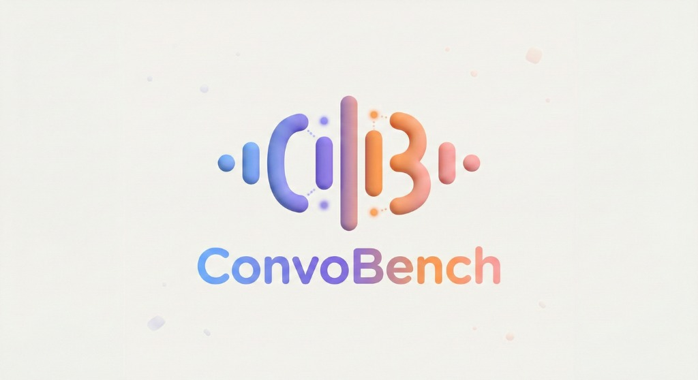

# PaperHunt

  

**Conversational AI Insight Discovery Tool** — 60+ curated research papers spanning 75 years, from Turing Test (1950) to Full-Duplex Real-time Interaction (2026).

🔗 **[paperhunt.org](https://paperhunt.org)**

---

## 🎯 Core Metrics

| Metric | Value | Description |
|--------|-------|-------------|
| **Papers** | 60+ | Curated research collection |
| **Human Turn Gap** | ~200ms | Natural conversation pause |
| **GPT-4o Latency** | ~320ms | Approaching human-level |
| **Target** | Full-Duplex | Listening while Speaking |

---

## 🗺️ Interactive Pipeline Map

Visual tier-based taxonomy for Voice Agent architecture:

| Tier | Category | Description |
|------|----------|-------------|
| **0** | Hall of Fame | Foundation classics (Turing, ELIZA, Transformer) |
| **2** | Ear (ASR) | Audio input processing |
| **3** | Brain (LLM) | Core intelligence layer |
| **4** | Voice (TTS) | Audio output synthesis |
| **5** | Support | Benchmarks & Tools (VoiceAgentEval) |
| **6** | Global | System-level design |

---

## 🔥 The Experience Gaps

Why typical voice bots feel robotic:

1. **Turn-Taking Gap** — 1-3s response delay breaks flow
2. **Barge-In** — Can't hear interruptions while speaking  
3. **Prosody & Affect** — Text conversion loses emotion
4. **Context Loss** — Single models can't handle orchestration

**Solution:** Omni-Duplex Architecture with streaming audio tokens

---

## ✨ Features

- 🗺️ **Interactive Pipeline Map** — Visual tier-based paper taxonomy
- 📊 **Core Metrics Dashboard** — WER, latency, research trends
- 🎯 **Experience Gaps Analysis** — Why bots feel robotic
- 📅 **Historical Timeline** — 1950-2026 milestones
- 🔍 **Smart Search** — Filter by era, tier, tags

---

Built with ❤️ for the Voice Agent community.

© 2026 PaperHunt
